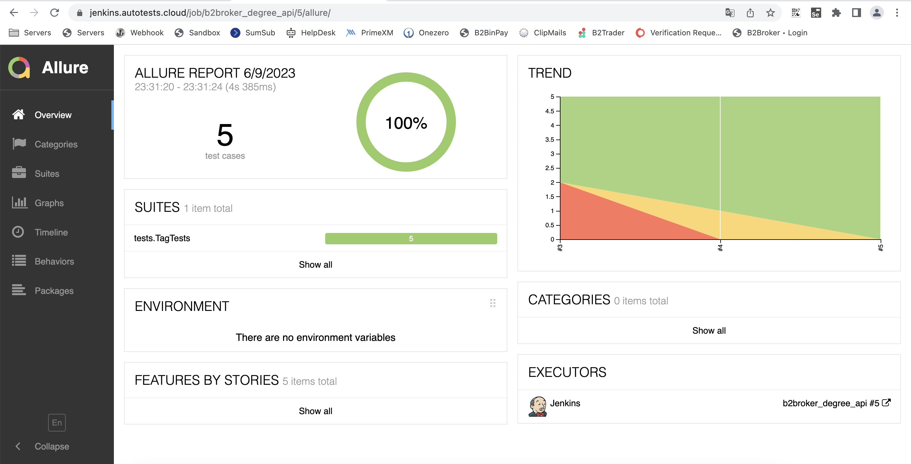
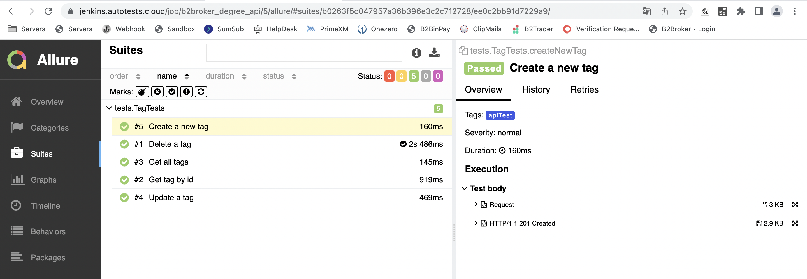
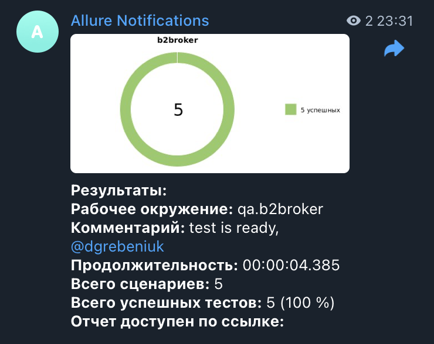

# Дипломный проект по тестированию API для [b2broker](https://my.b2broker.com/")

## :open_book: Содержание

- [Технологии и инструменты](#gear-технологии-и-инструменты)
- [Реализованныe проверки](#heavy_check_mark-тест-кейсы)
- [Запуск тестов из терминала](#computer-запуск-тестов-из-терминала)
- [Запуск тестов в Jenkins](#-запуск-тестов-в-jenkins)
- [Отчет о результатах тестирования в Allure Report](#-отчет-о-результатах-тестирования-в-Allure-report)
- [Уведомления в Telegram](#-уведомления-в-telegram)

## :gear: Технологии и инструменты

<p align="left">
<a href="https://www.jetbrains.com/idea/"></a>
<a href="https://www.java.com/"></a>
<a href="https://github.com/"></a>
<a href="https://junit.org/junit5/"></a>
<a href="https://gradle.org/"></a>
<a href="https://github.com/allure-framework/allure2"></a>
<a href="https://www.jenkins.io/"></a>
<a href="https://web.telegram.org/"></a>
</p>

## :heavy_check_mark: Тест кейсы

- Проверка отображения всех тэгов;
- Проверка отображения конкретного тэга;
- Проверка успешного создания тэга;
- Проверка успешного изменения тэга;
- Проверка успешного удаления тэга.


##  Запуск тестов из [Jenkins]("https://jenkins.autotests.cloud/job/b2broker_degree_api/")

Для запуска тестов из Jenkins:
1. Для запуска необходимо нажать "Собрать сейчас".

После выполнения сборки, в блоке <code><strong>*История сборок*</strong></code> напротив номера сборки появится
значок *Allure Report* кликнув по которому, откроется страница с сформированным отчетом и тестовой документацией.


### :earth_asia: Удаленный запуск тестов

```bash
clean
api_test
```


## :computer: Запуск тестов из терминала

Для локального запуска необходимо выполнить команду:
```
gradle clean
api_test
```


## :bar_chart: Отчеты о прохождении тестов доступны в Allure

###  Allure

#### Главная страница



#### Тесты



###  Telegram

Настроена отправка оточета ботом в Telegram


